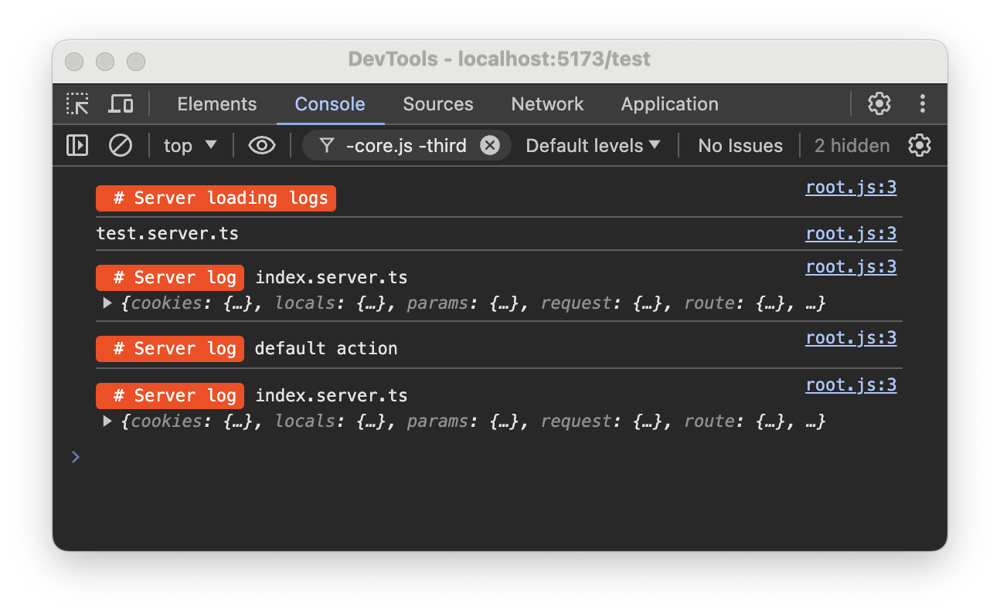

# sveltekit-plugin-console

Output server logs to the browser console.

## Install

```shell
pnpm add -D sveltekit-plugin-console
```

## Setup

```ts
// vite.config.ts
import { ConsolePlugin } from './src/lib/index.js';
...
plugins: [sveltekit(), ConsolePlugin()],
```

## Full Example

```ts
import { sveltekit } from '@sveltejs/kit/vite';
import { defineConfig } from 'vitest/config';
import { ConsolePlugin } from './src/lib/index.js';

export default defineConfig({
	plugins: [sveltekit(), ConsolePlugin()],
	test: {
		include: ['src/**/*.{test,spec}.{js,ts}']
	}
});
```

## Usage
Use console.log normally on server code. You don't need to change anything.

## Screenshots

