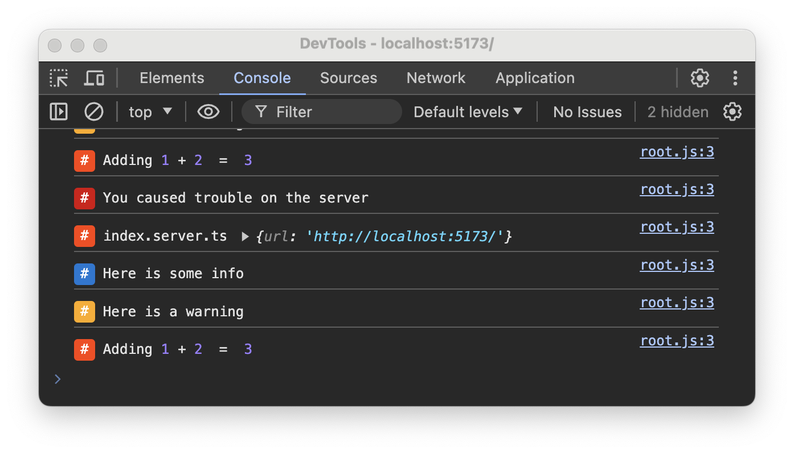

# sveltekit-plugin-console

Output server logs to the browser console.



## Install

```shell
pnpm add -D sveltekit-plugin-console
```

## Setup

```ts
// vite.config.ts
import { ConsolePlugin } from './src/lib/index.js';
...
plugins: [sveltekit(), ConsolePlugin()],
```

## Full Example

```ts
import { sveltekit } from '@sveltejs/kit/vite';
import { defineConfig } from 'vitest/config';
import { ConsolePlugin } from './src/lib/index.js';

export default defineConfig({
	plugins: [sveltekit(), ConsolePlugin()],
	test: {
		include: ['src/**/*.{test,spec}.{js,ts}']
	}
});
```

## Options
```ts
export type PluginOptions = {
	/**
	 * Whether to print logs in the server console normally or to suppress them
	 *
	 * Default: true
	 */
	log_on_server?: boolean;
}
```
## Usage
Use console.log normally on your server code. You don't need to change anything.

## Is this secure?
This plugin only works on serve mode. It does not affect your production build.

## Todos
- [ ] provide file:line-number and make it clickable if possible  
- [x] provide option to suppress logs on the server console (to avoid flooding)